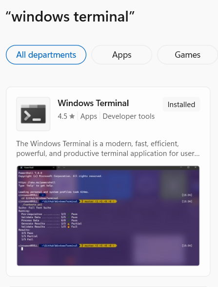
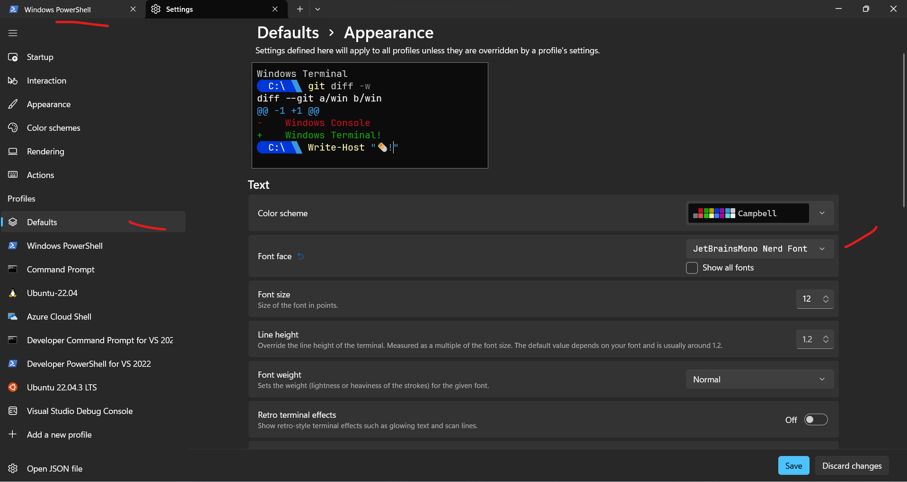
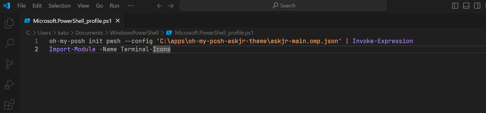
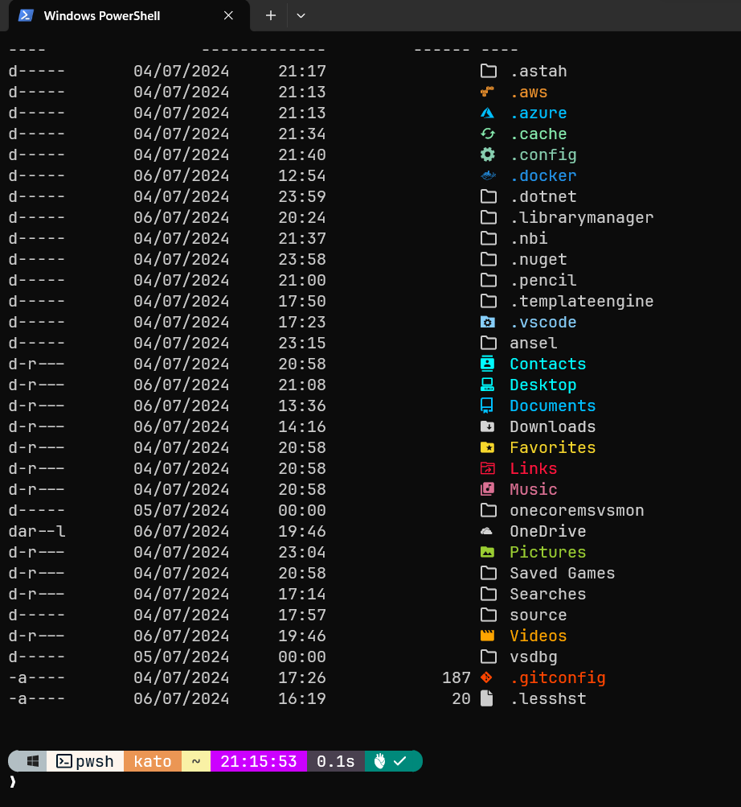
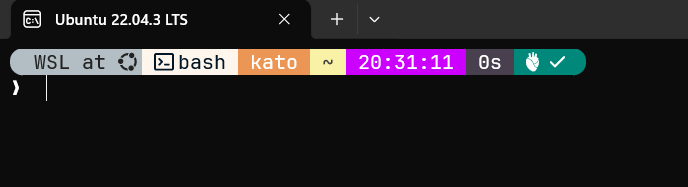
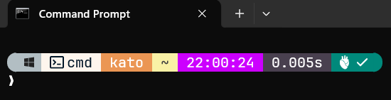

# My personal oh-my-posh theme

## About

"A prompt theme engine for any shell." - <https://ohmyposh.dev/>

I have configured my personal theme in askjr-main.omp.json file.

## Quick startup guide

### Windows powershell (W11)

Prerequisite:

0.Check in MS store if Windows Terminal is installed:



1.Install a nerd a font:
<https://github.com/ryanoasis/nerd-fonts>

2.Set a nerd font as default for console:



```console
Main steps:

1) Run in powershell:

    winget install JanDeDobbeleer.OhMyPosh -s winget

2) Run in powershell:

    winget upgrade JanDeDobbeleer.OhMyPosh -s winget

3) Run in powershell:

    oh-my-posh init pwsh --config ~/jandedobbeleer.omp.json | Invoke-Expression

4) Run in powershell:

    code $PROFILE

5) Run in powershell (optional):

    if #4 fails, then:
        5.1) New-Item -Path $PROFILE -Type File -Force
        5.2) Repeat #4

6) Add the following lines to the file ($PROFILE):

    6.1) oh-my-posh init pwsh --config 'C:\Users\user\themes\yourtheme.omp.json' | Invoke-Expression

7) Run in powershell (getting icons):

    Install-Module -Name Terminal-Icons -Repository PSGallery
        7.1) Run in powershell
                code $PROFILE
        7.2)  Add the following lines to the file ($PROFILE):
                Import-Module -Name Terminal-Icons

```

#### File $profile



#### Results for powershell




### WSL Ubuntu bash

```bash

mkdir bin

#In case unzip is not installed
sudo apt-get install unzip

curl -s https://ohmyposh.dev/install.sh | bash -s -- -d ~/bin


nano .profile

# Add the follwing lines in .profile (if does not exist already)
if [ -f ~/.bashrc ]; then
    . ~/.bashrc
fi


nano ~/.bashrc

# Add the followin lines in ~/.bashrc
# Add /home/kato/bin to PATH
export PATH=$HOME/bin:$PATH

# Load oh-my-posh configuration
eval "$(oh-my-posh init bash --config 'https://raw.githubusercontent.com/ASKJR/oh-my-posh-askjr-theme/main/askjr-main.omp.json')"

#For nano, press Ctrl + O, Enter, and Ctrl + X.

# Apply the changes:
source ~/.bashrc

```

#### Results for bash



### CMD (W11)

In CMD:

```cmd
0) winget install JanDeDobbeleer.OhMyPosh -s winget

1) winget install clink

2) clink info

3) Navigate to scripts folder path listed by the previous command.
  3.1) e.g C:\Users\kato\AppData\Local\clink

4) Create 'oh-my-posh.lua' file
    4.1) Add the following line:
        load(io.popen('oh-my-posh init cmd --config "https://raw.githubusercontent.com/ASKJR/oh-my-posh-askjr-theme/main/askjr-main.omp.json"'):read("*a"))()
    4.2) Save

5) Restart CMD
```

#### Results for CMD


