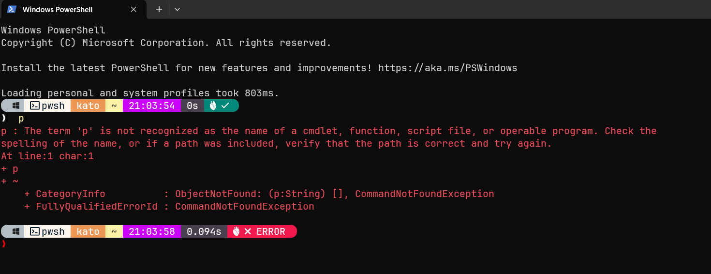
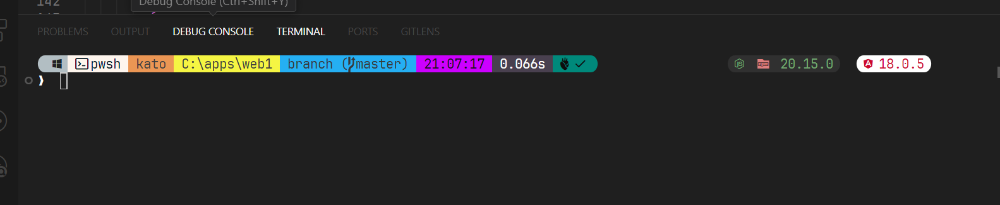

# Windows powershell

```console
1) Run in powershell:

    winget install JanDeDobbeleer.OhMyPosh -s winget

2) Run in powershell:

    winget upgrade JanDeDobbeleer.OhMyPosh -s winget

3) Run in powershell:

    oh-my-posh init pwsh --config ~/jandedobbeleer.omp.json | Invoke-Expression

4) Run in powershell:

    code $PROFILE

5) Run in powershell (optional):

    if #4 fails, then:
        5.1) New-Item -Path $PROFILE -Type File -Force
        5.2) Repeat #4

6) Add the following lines to the file ($PROFILE):

    6.1) oh-my-posh init pwsh --config 'C:\Users\user\themes\yourtheme.omp.json' | Invoke-Expression

7) Run in powershell (getting icons):

    Install-Module -Name Terminal-Icons -Repository PSGallery
        7.1) Run in powershell
                code $PROFILE
        7.2)  Add the following lines to the file ($PROFILE):
                Import-Module -Name Terminal-Icons

```




